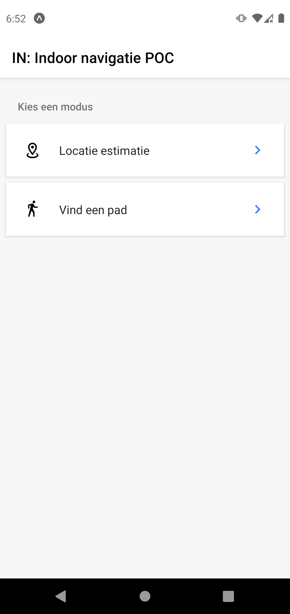
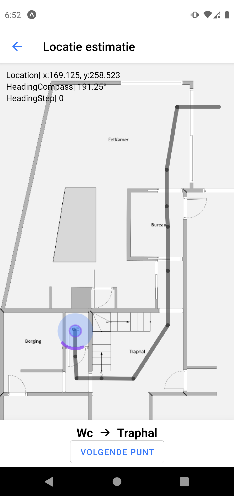
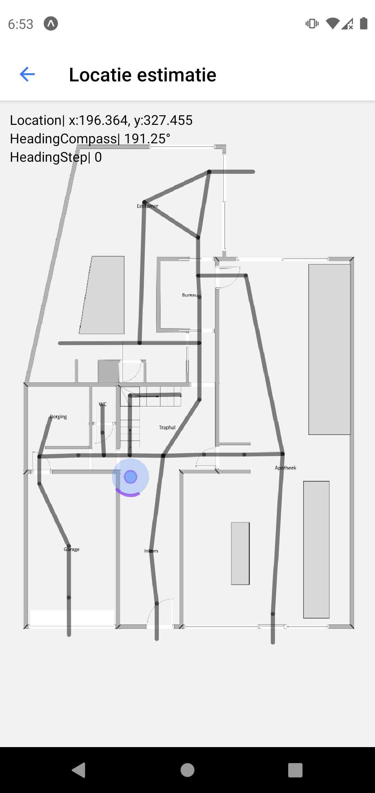

# IN:indoor navigation
<p float="left">
  
  
   
  
</p>

Broncode van de IN proof of concept applicatie. Gemaakt als bachelorproefonderzoek bij HoGent.

Functionaliteiten
- Selecteer een pad om te volgen in een indoor locatie
- De applicatie update de positie door middel van Pedestrian dead reckoning
- Maar 1 locatie beschikbaar

Gemaakt met React Native en Expo

Belangrijke gebruikte libraries
- react-native-smartpdr
- ngraph
- react-native-svg

# Usage
```powershell
git clone https://github.com/Daellhin/Hogent-Bachelorproef-IN.git
npm i
npx expo start
```